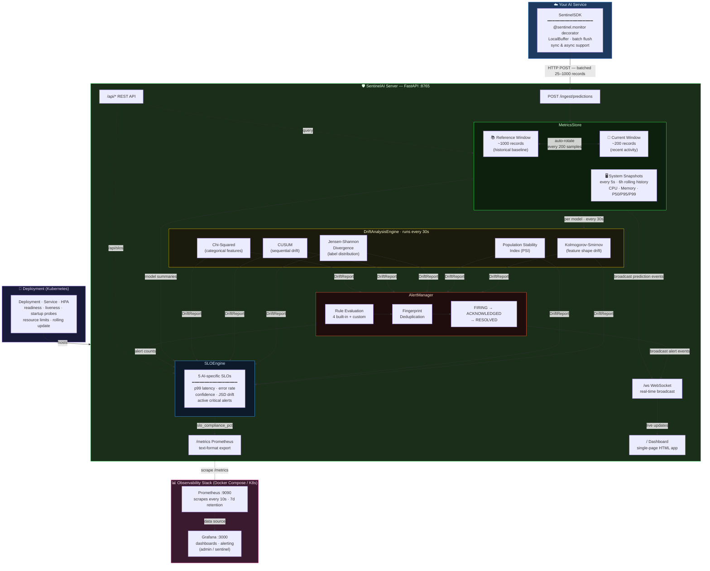

# 🛡️ SentinelAI — AI Reliability & Observability System

> **Because `HTTP 200` doesn't mean your model is working.**

[](LICENSE)
[](https://www.python.org/)
[](https://fastapi.tiangolo.com/)

---

## The Problem

A standard fraud detection model returns HTTP 200. Latency is normal. CPU is fine. PagerDuty is silent.

But yesterday, 18% of transactions were flagged as fraud. Today it's 97%.

**The model is completely broken. Your infrastructure monitors have no idea.**

```
Traditional monitoring sees:          SentinelAI sees:
  ✅ HTTP 200                           🚨 Prediction distribution shifted
  ✅ P95 latency: 45ms                  🚨 Input feature 'amount_normalised' PSI=0.48
  ✅ CPU: 12%                           🚨 Confidence collapsed: 0.87 → 0.31
  ✅ Error rate: 0%                     🚨 JSD divergence: 0.42 (threshold: 0.1)
  ✅ Pod restarts: 0                    ✅ Infrastructure fine — model broken
```

## What SentinelAI Does

SentinelAI monitors **two layers simultaneously**:

### Layer A — System Reliability
| Metric | How |
|---|---|
| Request count & throughput | Per-model counters |
| Inference latency (P50/P95/P99) | Rolling window tracker |
| Error rate | Exception capture in SDK |
| CPU & Memory | `psutil` snapshots every 5s |
| Prometheus metrics | `/metrics` endpoint |

### Layer B — Model Reliability (the hard part)
| Signal | Algorithm |
|---|---|
| Prediction distribution shift | Jensen-Shannon Divergence |
| Input feature data drift | Kolmogorov-Smirnov Test |
| Input feature population drift | Population Stability Index (PSI) |
| Confidence score drift | KS Test + CUSUM |
| Output class anomaly | Chi-Squared Test |
| Sequential drift detection | CUSUM (Cumulative Sum) |

---

## Architecture



---

## Quick Start

### 1. Run the server

```bash
# Clone
git clone https://github.com/sentinel-ai/sentinel-ai
cd sentinel-ai

# Install
pip install -r requirements.txt

# Start the observability server
uvicorn sentinel.server:app --port 8765 --reload

# Dashboard: http://localhost:8765
# API docs:  http://localhost:8765/docs
```

### 2. Instrument your model (3 lines)

```python
from sentinel.sdk import SentinelSDK

sentinel = SentinelSDK(model_name="my-model", server_url="http://localhost:8765")

@sentinel.monitor
def predict(features: dict) -> dict:
    # Your existing code — completely unchanged
    return {"label": "fraud", "confidence": 0.93}
```

That's it. SentinelAI now captures:
- Every prediction label and confidence score
- Input feature values (for drift detection)
- Latency per call
- Any exceptions

### 3. Run the fraud detection demo

```bash
# Terminal 1: start server
uvicorn sentinel.server:app --port 8765

# Terminal 2: run demo (simulates silent model failure)
python examples/fraud_detection_demo.py
```

Watch the dashboard detect the failure that your infrastructure monitors miss.

### 4. Docker (full stack)

```bash
docker compose up
```

| Service | URL | Purpose |
|---|---|---|
| SentinelAI | http://localhost:8765 | Dashboard + API |
| Prometheus | http://localhost:9090 | Metrics store |
| Grafana | http://localhost:3000 | Grafana dashboards (admin/sentinel) |

---

## SDK Reference

### Basic usage

```python
sentinel = SentinelSDK(
    model_name="fraud-detector-v2",
    server_url="http://localhost:8765",
    flush_every=25,             # batch size before flush
    capture_inputs=True,        # capture feature values for drift detection
    input_sample_rate=0.5,      # sample 50% of inputs (reduce overhead)
)
```

### Decorator (auto capture)

```python
@sentinel.monitor
def predict(features: dict) -> dict:
    return {"label": "cat", "confidence": 0.91}

# Custom key names
@sentinel.monitor(label_key="class", confidence_key="probability")
def predict(features: dict) -> dict:
    return {"class": "cat", "probability": 0.91}

# Async models fully supported
@sentinel.monitor
async def predict_async(features: dict) -> dict:
    result = await model.ainfer(features)
    return result
```

### Manual recording

```python
sentinel.record_prediction(
    inputs={"amount": 150.0, "merchant": "Amazon"},
    label="legitimate",
    confidence=0.87,
    latency_ms=23.4,
)
```

---

## API Reference

### Ingestion (SDK → Server)
| Endpoint | Method | Description |
|---|---|---|
| `/ingest/predictions` | POST | Batch prediction telemetry |
| `/ingest/baseline` | POST | Set reference baseline |

### Query
| Endpoint | Method | Description |
|---|---|---|
| `/api/models` | GET | All model summaries |
| `/api/models/{name}` | GET | Single model details |
| `/api/models/{name}/drift` | POST | Trigger drift analysis |
| `/api/system/current` | GET | Latest system snapshot |
| `/api/system/history` | GET | Rolling system history |
| `/api/alerts` | GET | Active alerts |
| `/api/alerts/history` | GET | Alert history |
| `/api/alerts/acknowledge` | POST | Acknowledge alert |
| `/api/alerts/resolve` | POST | Resolve alert |
| `/metrics` | GET | Prometheus text format |

---

## Drift Detection Algorithms

### Population Stability Index (PSI)
Industry-standard metric from credit scoring, ideal for monitoring feature distributions.
- PSI < 0.1 → No shift
- PSI 0.1–0.2 → Slight shift, investigate
- PSI > 0.2 → Significant shift, likely retrain needed

### Kolmogorov-Smirnov Test
Non-parametric test that detects ANY shape change in continuous distributions (mean, variance, skew).
Catches drift that mean-only monitoring misses.

### Jensen-Shannon Divergence
Symmetric, bounded [0,1] measure of divergence between prediction label distributions.
The most reliable signal for detecting when your model starts predicting differently.

### CUSUM (Cumulative Sum)
Sequential change-point detection for time-ordered signals.
Catches gradual drift before it becomes a crisis.

---

## Alert Rules (built-in)

| Rule | Trigger | Severity |
|---|---|---|
| `prediction_distribution_shift` | JSD > 0.1 on label distribution | WARNING / CRITICAL |
| `confidence_collapse` | Avg confidence drops >10pp | WARNING / CRITICAL |
| `high_psi_feature` | Any input feature PSI > 0.2 | WARNING / CRITICAL |
| `high_error_rate` | Error rate delta > 5% | WARNING / CRITICAL |

### Custom rules

```python
from sentinel.alerts import Alert, AlertSeverity, AlertState

def my_rule(report) -> Optional[Alert]:
    # Evaluate the DriftReport and return an Alert or None
    if some_condition(report):
        return Alert(
            alert_id=str(uuid.uuid4()),
            fingerprint="my-model:my-rule",
            model_name=report.model_name,
            rule_name="my_custom_rule",
            severity=AlertSeverity.WARNING,
            state=AlertState.FIRING,
            title="My custom alert",
            description="Something I care about shifted",
            fired_at=report.timestamp,
        )

alert_manager.register_rule(my_rule)
```

---

---

## Kubernetes Deployment

Production-style manifests live in `k8s/`. Deploy in order:

```bash
kubectl apply -f k8s/namespace.yaml
kubectl apply -f k8s/configmap.yaml
kubectl apply -f k8s/deployment.yaml
kubectl apply -f k8s/service.yaml
kubectl apply -f k8s/hpa.yaml
# Optional — requires prometheus-operator
kubectl apply -f k8s/prometheus-servicemonitor.yaml
```

What's included:

| File | What it does |
|---|---|
| `namespace.yaml` | Isolated `sentinel-ai` namespace |
| `configmap.yaml` | Externalised config (log level, window sizes) |
| `deployment.yaml` | 2 replicas, rolling update (maxUnavailable=0), liveness + readiness + startup probes, resource limits, non-root security context, topology spread |
| `service.yaml` | ClusterIP (in-cluster SDK traffic) + NodePort (dashboard access) |
| `hpa.yaml` | Scales 2→6 replicas on CPU/memory — handles burst prediction ingest |
| `prometheus-servicemonitor.yaml` | Auto-scrapes `/metrics` via Prometheus Operator |

### Readiness / Liveness probes

The Deployment uses all three Kubernetes probe types on `/health`:

```
startupProbe   → 60s budget for cold start
readinessProbe → removed from LB until healthy (no 503s during rollout)
livenessProbe  → restart container if server hangs
```

This gives zero-downtime rolling deploys with `maxUnavailable: 0`.

---

## SLOs (Service Level Objectives)

SentinelAI tracks AI-specific SLOs that go beyond traditional infra SLOs.

```
GET /api/slos
```

```json
{
  "overall_status": "breached",
  "total": 5,
  "ok": 3,
  "warning": 1,
  "breached": 1,
  "slos": [
    {
      "name": "inference_p99_latency_ms",
      "target": 200.0,
      "current_value": 143.2,
      "status": "ok",
      "compliance_pct": 100.0
    },
    {
      "name": "prediction_jsd_drift",
      "target": 0.1,
      "current_value": 0.42,
      "status": "breached",
      "compliance_pct": 23.8
    },
    {
      "name": "avg_confidence",
      "target": 0.65,
      "current_value": 0.31,
      "status": "breached",
      "compliance_pct": 47.7
    }
  ]
}
```

SLO compliance is also exported as a Prometheus metric:

```
sentinel_slo_compliance_pct{slo="prediction_jsd_drift",status="breached"} 23.8
sentinel_slo_compliance_pct{slo="avg_confidence",status="breached"} 47.7
```

| SLO | Target | Why it matters |
|---|---|---|
| `inference_p99_latency_ms` | < 200 ms | User-facing inference latency budget |
| `error_rate_pct` | < 1% | Inference reliability |
| `avg_confidence` | > 0.65 | Model certainty — low confidence = OOD inputs |
| `prediction_jsd_drift` | < 0.10 | Label distribution stability |
| `active_critical_alerts` | 0 | No unacknowledged critical failures |

---

## Canary Rollout Safety Demo

The most powerful use case: **catching a bad model deployment before it reaches 100% of traffic.**

```bash
python examples/canary_rollout_demo.py
```

Scenario:

```
model-v1  →  stable, healthy (90% traffic)
model-v2  →  regression: feature weight misconfiguration (10% canary)

Infrastructure signals:  HTTP 200 ✅  |  CPU normal ✅  |  Latency normal ✅
SentinelAI signals:      JSD drift 0.38 🚨  |  Confidence collapsed 🚨  |  Alert fired 🚨
```

Demo phases:

1. **Warm-up** — 400 requests to v1, establishes healthy reference window
2. **Canary** — 90/10 traffic split introduced; v2 degradation is silent to infra
3. **Detection** — SentinelAI triggers drift analysis, fires alerts, evaluates SLOs
4. **Rollback** — traffic returned to 100% v1; metrics recover

In a real Kubernetes canary workflow, step 4 maps to:

```bash
# Argo Rollouts
kubectl argo rollouts abort classifier

# Or plain kubectl
kubectl set image deployment/classifier app=classifier:v1
```

---

## Roadmap

- [ ] Slack / PagerDuty notification hooks
- [ ] SHAP-based feature importance drift
- [ ] A/B model comparison mode
- [ ] Model performance proxy metrics (using delayed ground truth)
- [ ] Kubernetes operator for auto-deployment
- [ ] OpenTelemetry exporter
- [ ] Persistent storage backend (SQLite / PostgreSQL)
- [ ] Multi-tenant / multi-team support

---

## Contributing

1. Fork the repo
2. Create a feature branch (`git checkout -b feat/my-feature`)
3. Add tests in `tests/`
4. Submit a PR

---

## License

MIT © SentinelAI Contributors
