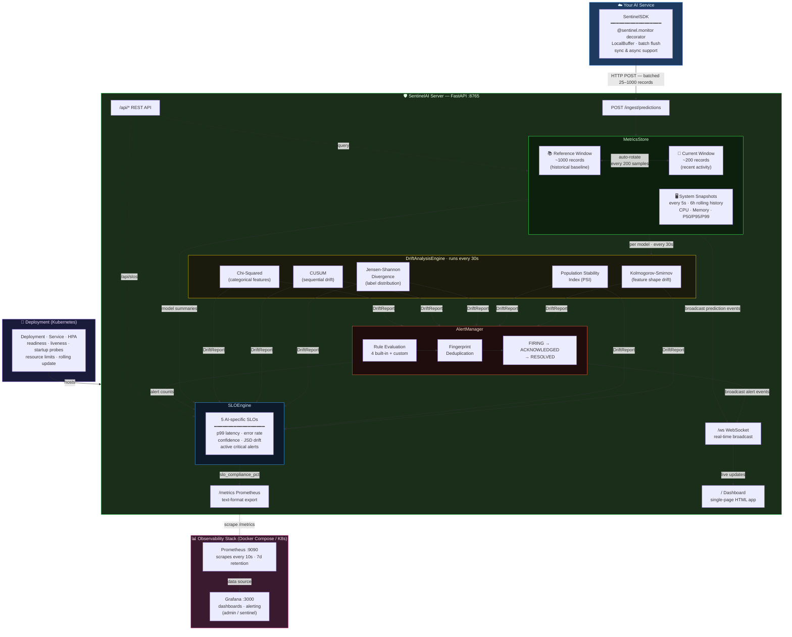

# SentinelAI

**SentinelAI is a reliability layer for AI systems that detects silent model failures missed by traditional infrastructure monitoring.**

[](LICENSE)
[](https://www.python.org/)
[](https://fastapi.tiangolo.com/)

Traditional SRE stacks watch CPU, latency, and HTTP status. They cannot see what the model is actually predicting.

SentinelAI closes that gap — it instruments AI inference, detects distribution shift and confidence collapse, enforces AI-specific SLOs, and fires alerts before a silent failure reaches your users.

**Built for:** AI Reliability Engineers · ML Platform Engineers · MLOps · Inference Platform Teams

---

## The Problem

Traditional infrastructure monitoring cannot tell you if your model is working correctly.

- Infra metrics (CPU, latency, HTTP status) report a healthy system
- Model predictions degrade silently — wrong outputs, biased labels, collapsed confidence
- No alert fires. No on-call page. Users are already impacted.

## Example Failure

> A fraud detection model ships a data pipeline change on a Tuesday afternoon.

- The `amount_normalised` feature stops normalising — raw dollar values leak through
- The model now scores every transaction as high risk
- **97% of transactions are blocked**
- The API still returns `200 OK`
- P95 latency: normal. CPU: normal. Pod restarts: 0.
- PagerDuty: silent

Your on-call engineer finds out when the fraud team calls in a panic — 40 minutes later.

```
Traditional monitoring sees:          SentinelAI sees:
  ✅ HTTP 200                           🚨 Prediction distribution shifted
  ✅ P95 latency: 45ms                  🚨 Input feature 'amount_normalised' PSI=0.48
  ✅ CPU: 12%                           🚨 Confidence collapsed: 0.87 → 0.31
  ✅ Error rate: 0%                     🚨 JSD divergence: 0.42 (threshold: 0.1)
  ✅ Pod restarts: 0                    ✅ Infrastructure fine — model broken
```

## The Solution

SentinelAI instruments your model at inference time and watches what infra monitoring ignores:

- **Monitor prediction distribution** — track label ratios and confidence scores in real time
- **Detect drift and anomalies** — run KS, PSI, JSD, and CUSUM tests against a healthy baseline
- **Enforce AI-specific SLOs** — define reliability contracts on model behavior, not just uptime
- **Trigger structured alerts** — fire before users are impacted, with full context for fast triage

## End-to-End Demo: Silent Failure → Detection → Alert

Run this in two terminals to see the full failure-detection cycle:

```bash
# Terminal 1 — start SentinelAI
uvicorn sentinel.server:app --port 8765

# Terminal 2 — run the fraud demo (simulates silent model failure)
python examples/fraud_detection_demo.py
```

**What happens, step by step:**

**Step 1 — Healthy baseline (500 requests)**
```
[HEALTHY] req=500 | fraud=21.4% ████ | legit=78.6% ███████████████ | avg_conf=73.2%
```
Model behaves normally. ~20% fraud rate. Confidence well-calibrated.

**Step 2 — Data pipeline bug introduced (silent)**
```
[BROKEN]  req=100 | fraud=94.1% ██████████████████ | legit=5.9%  | avg_conf=31.4%
```
Every transaction now scores as fraud. HTTP 200. CPU normal. No infra alert.

**Step 3 — SentinelAI detects the failure**
```
WARNING  sentinel.drift     DRIFT DETECTED [CRITICAL] — 3/5 signals drifted:
                            prediction_labels, confidence_score, input:amount_normalised

WARNING  sentinel.alerts    ALERT FIRED: [CRITICAL] Prediction distribution shifted — fraud-detector-v2
                            JSD=0.42 (threshold=0.1) | fraud: 21% → 94%

WARNING  sentinel.alerts    ALERT FIRED: [CRITICAL] Confidence collapse detected — fraud-detector-v2
                            Confidence dropped 0.87 → 0.31 (Δ=56pp). Model receiving OOD inputs.

WARNING  sentinel.alerts    ALERT FIRED: [WARNING] Input feature drift — input:amount_normalised
                            PSI=0.48 (threshold=0.2). Likely data pipeline change upstream.
```

**Step 4 — Alert payload (what fires to PagerDuty / Slack)**
```json
{
  "alert_id": "a3f2c1d4-...",
  "title": "[CRITICAL] Prediction distribution shifted — fraud-detector-v2",
  "severity": "critical",
  "state": "firing",
  "description": "Label distribution shifted (JSD=0.42). fraud: 21% → 94%.",
  "fired_at": "2026-03-24T10:42:11Z",
  "labels": { "model": "fraud-detector-v2", "test": "jsd" },
  "annotations": { "runbook": "https://github.com/sentinel-ai/runbooks/prediction-drift" }
}
```

**Step 5 — SLO breach confirmed**
```
GET /api/slos

{
  "overall_status": "breached",
  "slos": [
    { "name": "prediction_jsd_drift",  "target": 0.10, "current": 0.42, "status": "breached" },
    { "name": "avg_confidence",        "target": 0.65, "current": 0.31, "status": "breached" },
    { "name": "active_critical_alerts","target": 0,    "current": 2,    "status": "breached" }
  ]
}
```

**Total time from failure to alert: under 2 minutes.**
Traditional infra monitoring: still showing green.

---

Also try the **canary rollout demo** — catches a bad model deployment at 10% traffic before full rollout:

```bash
python examples/canary_rollout_demo.py
```

---

## What SentinelAI Does

SentinelAI monitors **two layers simultaneously**:

### Layer A — System Reliability
| Metric | How |
|---|---|
| Request count & throughput | Per-model counters |
| Inference latency (P50/P95/P99) | Rolling window tracker |
| Error rate | Exception capture in SDK |
| CPU & Memory | `psutil` snapshots every 5s |
| Prometheus metrics | `/metrics` endpoint |

### Layer B — Model Reliability (the hard part)
| Signal | Algorithm |
|---|---|
| Prediction distribution shift | Jensen-Shannon Divergence |
| Input feature data drift | Kolmogorov-Smirnov Test |
| Input feature population drift | Population Stability Index (PSI) |
| Confidence score drift | KS Test + CUSUM |
| Output class anomaly | Chi-Squared Test |
| Sequential drift detection | CUSUM (Cumulative Sum) |

---

## AI System SLOs

SentinelAI enforces reliability contracts on **model behavior**, not just uptime.

| SLO | Target | Why It Matters |
|---|---|---|
| Inference latency (P99) | < 200 ms | User-facing latency budget |
| Error rate | < 1% | Inference reliability floor |
| Average prediction confidence | > 0.65 | Below this = model is confused or seeing OOD inputs |
| Prediction distribution drift (JSD) | < 0.10 | Label ratios stable vs healthy baseline |
| Active critical alerts | 0 | No unacknowledged failures in production |

Query live SLO status at any time:

```bash
curl http://localhost:8765/api/slos
```

```json
{
  "overall_status": "breached",
  "ok": 2,
  "warning": 0,
  "breached": 3,
  "slos": [
    { "name": "inference_p99_latency_ms", "target": 200,  "current_value": 143.2, "status": "ok"      },
    { "name": "error_rate_pct",           "target": 1.0,  "current_value": 0.4,   "status": "ok"      },
    { "name": "avg_confidence",           "target": 0.65, "current_value": 0.31,  "status": "breached"},
    { "name": "prediction_jsd_drift",     "target": 0.10, "current_value": 0.42,  "status": "breached"},
    { "name": "active_critical_alerts",   "target": 0,    "current_value": 2,     "status": "breached"}
  ]
}
```

SLO compliance is also exported as a Prometheus metric for Grafana alerting:

```
sentinel_slo_compliance_pct{slo="prediction_jsd_drift",  status="breached"} 23.8
sentinel_slo_compliance_pct{slo="avg_confidence",        status="breached"} 47.7
sentinel_slo_compliance_pct{slo="inference_p99_latency_ms", status="ok"}   100.0
```

> This is what separates AI reliability from traditional SRE — your error budget includes model behavior, not just HTTP availability.

---

## Architecture



---

## Quick Start

### 1. Run the server

```bash
# Clone
git clone https://github.com/sentinel-ai/sentinel-ai
cd sentinel-ai

# Install
pip install -r requirements.txt

# Start the observability server
uvicorn sentinel.server:app --port 8765 --reload

# Dashboard: http://localhost:8765
# API docs:  http://localhost:8765/docs
```

### 2. Instrument your model (3 lines)

```python
from sentinel.sdk import SentinelSDK

sentinel = SentinelSDK(model_name="my-model", server_url="http://localhost:8765")

@sentinel.monitor
def predict(features: dict) -> dict:
    # Your existing code — completely unchanged
    return {"label": "fraud", "confidence": 0.93}
```

That's it. SentinelAI now captures:
- Every prediction label and confidence score
- Input feature values (for drift detection)
- Latency per call
- Any exceptions

### 3. Run the fraud detection demo

```bash
# Terminal 1: start server
uvicorn sentinel.server:app --port 8765

# Terminal 2: run demo (simulates silent model failure)
python examples/fraud_detection_demo.py
```

Watch the dashboard detect the failure that your infrastructure monitors miss.

### 4. Docker (full stack)

```bash
docker compose up
```

| Service | URL | Purpose |
|---|---|---|
| SentinelAI | http://localhost:8765 | Dashboard + API |
| Prometheus | http://localhost:9090 | Metrics store |
| Grafana | http://localhost:3000 | Grafana dashboards (admin/sentinel) |

---

## SentinelAI SDK

The SDK provides **drop-in instrumentation for ML services** — it captures prediction metadata, latency, and model behavior signals at inference time, and ships them to the SentinelAI server for drift analysis and alerting.

It requires zero changes to your existing model logic. Add one decorator. The SDK handles the rest:

- Captures every prediction label, confidence score, and input feature snapshot
- Measures latency per inference call with microsecond precision
- Catches and records exceptions without interrupting the inference path
- Batches records locally and flushes asynchronously — no latency overhead on your model
- Falls back to local buffer if the server is unreachable — no data loss on network blips
- Supports both sync and async inference functions natively

```python
sentinel = SentinelSDK(
    model_name="fraud-detector-v2",
    server_url="http://sentinel-ai.sentinel-ai.svc.cluster.local:8765",
    flush_every=25,             # batch size before async flush
    capture_inputs=True,        # capture feature values for drift detection
    input_sample_rate=0.5,      # sample 50% of inputs to reduce overhead at scale
)
```

### Decorator (auto capture)

```python
@sentinel.monitor
def predict(features: dict) -> dict:
    return {"label": "cat", "confidence": 0.91}

# Custom key names
@sentinel.monitor(label_key="class", confidence_key="probability")
def predict(features: dict) -> dict:
    return {"class": "cat", "probability": 0.91}

# Async models fully supported
@sentinel.monitor
async def predict_async(features: dict) -> dict:
    result = await model.ainfer(features)
    return result
```

### Manual recording

```python
sentinel.record_prediction(
    inputs={"amount": 150.0, "merchant": "Amazon"},
    label="legitimate",
    confidence=0.87,
    latency_ms=23.4,
)
```

---

## API Reference

### Ingestion (SDK → Server)
| Endpoint | Method | Description |
|---|---|---|
| `/ingest/predictions` | POST | Batch prediction telemetry |
| `/ingest/baseline` | POST | Set reference baseline |

### Query
| Endpoint | Method | Description |
|---|---|---|
| `/api/models` | GET | All model summaries |
| `/api/models/{name}` | GET | Single model details |
| `/api/models/{name}/drift` | POST | Trigger drift analysis |
| `/api/system/current` | GET | Latest system snapshot |
| `/api/system/history` | GET | Rolling system history |
| `/api/alerts` | GET | Active alerts |
| `/api/alerts/history` | GET | Alert history |
| `/api/alerts/acknowledge` | POST | Acknowledge alert |
| `/api/alerts/resolve` | POST | Resolve alert |
| `/metrics` | GET | Prometheus text format |

---

## Drift Detection Algorithms

SentinelAI runs multiple tests in parallel because no single algorithm catches every failure mode. Each test has a specific use case, and they complement each other.

### When to use PSI vs KS

| | PSI (Population Stability Index) | KS Test (Kolmogorov-Smirnov) |
|---|---|---|
| **Best for** | Input feature monitoring, batch scoring pipelines | Continuous distributions: latency, confidence scores |
| **Catches** | Overall distribution shape change | Any shape difference — mean, variance, skew, tail |
| **Origin** | Credit risk / financial modelling standard | Non-parametric statistics |
| **Output** | Bounded score (no p-value) — easy to threshold | p-value — requires alpha interpretation |
| **Use when** | You want a single stable number to track over time | You want maximum sensitivity to any distribution change |

**Rule of thumb:** Use PSI for input features going into your model. Use KS for confidence scores and latency.

### Population Stability Index (PSI)

```
PSI < 0.1   → Stable. No action needed.
PSI 0.1–0.2 → Slight shift. Investigate upstream data pipeline.
PSI > 0.2   → Significant shift. Likely retrain or pipeline fix needed.
```

**Limitation:** PSI requires binning, so it can miss sharp localised changes within a bin. It also needs a minimum of ~20 samples per bin to be reliable — unreliable on very small windows.

**False positive risk:** Low. PSI is conservative by design (built for production finance systems). A PSI > 0.2 is almost always a real signal.

### Kolmogorov-Smirnov Test

Detects **any** shape change in continuous distributions — not just mean shift. Catches when variance collapses, tails get heavier, or distributions become bimodal.

**Limitation:** Sensitive to sample size. With large windows (n > 500), even trivial differences become statistically significant. SentinelAI caps severity using the KS statistic itself, not just the p-value, to avoid noise from large samples.

**False positive risk:** Medium at high sample sizes. Always pair with the statistic threshold, not just `p < 0.05`.

### Jensen-Shannon Divergence (JSD)

Measures divergence between **prediction label distributions** — the most direct signal that your model is predicting differently than its baseline.

```
JSD < 0.05  → Stable
JSD 0.05–0.1 → Slight shift, monitor
JSD > 0.1   → Notable drift — alert fires
JSD > 0.2   → Significant — likely model or data regression
```

Bounded [0, 1] and symmetric — unlike KL divergence, it never explodes to infinity.

**False positive risk:** Low for sudden failures (e.g., fraud demo). Moderate for slow label drift over weeks — use CUSUM for that.

### CUSUM (Cumulative Sum)

Catches **gradual drift** that snapshot tests miss. Accumulates small consistent deviations until they exceed a threshold — ideal for confidence score degradation that happens over hours, not minutes.

**Limitation:** Requires a fitted baseline (`cusum.fit(reference)`). Resets on rollback, so it won't carry state across deployments unless explicitly re-fitted.

**False positive risk:** Low when drift parameter is tuned. Default settings are conservative (`threshold=5.0, drift=0.3`).

---

## Alert Rules (built-in)

| Rule | Trigger | Severity |
|---|---|---|
| `prediction_distribution_shift` | JSD > 0.1 on label distribution | WARNING / CRITICAL |
| `confidence_collapse` | Avg confidence drops >10pp | WARNING / CRITICAL |
| `high_psi_feature` | Any input feature PSI > 0.2 | WARNING / CRITICAL |
| `high_error_rate` | Error rate delta > 5% | WARNING / CRITICAL |

### Custom rules

```python
from sentinel.alerts import Alert, AlertSeverity, AlertState

def my_rule(report) -> Optional[Alert]:
    # Evaluate the DriftReport and return an Alert or None
    if some_condition(report):
        return Alert(
            alert_id=str(uuid.uuid4()),
            fingerprint="my-model:my-rule",
            model_name=report.model_name,
            rule_name="my_custom_rule",
            severity=AlertSeverity.WARNING,
            state=AlertState.FIRING,
            title="My custom alert",
            description="Something I care about shifted",
            fired_at=report.timestamp,
        )

alert_manager.register_rule(my_rule)
```

---

---

## Kubernetes Deployment

SentinelAI ships production-ready Kubernetes manifests. This is not a local-only tool — it is designed to run **inside your inference cluster**, alongside the models it monitors.

```bash
# Deploy the full stack to a k8s cluster
kubectl apply -f k8s/namespace.yaml
kubectl apply -f k8s/configmap.yaml
kubectl apply -f k8s/deployment.yaml
kubectl apply -f k8s/service.yaml
kubectl apply -f k8s/hpa.yaml

# Auto-scrape /metrics via Prometheus Operator (optional)
kubectl apply -f k8s/prometheus-servicemonitor.yaml
```

### What the manifests include

| File | What it does |
|---|---|
| `namespace.yaml` | Isolated `sentinel-ai` namespace |
| `configmap.yaml` | Externalised config — window sizes, log level, drift interval |
| `deployment.yaml` | 2 replicas, non-root security context, topology spread across nodes |
| `service.yaml` | ClusterIP for SDK traffic + NodePort for dashboard |
| `hpa.yaml` | Autoscales 2 → 6 replicas on CPU + memory |
| `prometheus-servicemonitor.yaml` | Prometheus Operator integration |

### Zero-downtime rolling updates

```yaml
strategy:
  type: RollingUpdate
  rollingUpdate:
    maxUnavailable: 0   # never drop below full capacity during rollout
    maxSurge: 1         # spin up one extra pod before terminating old
```

All three probe types are configured so the rollout only proceeds when the new pod is truly healthy:

```
startupProbe   → 60s cold-start budget (model warming, connection setup)
readinessProbe → removed from load balancer until /health returns 200
livenessProbe  → auto-restart if server deadlocks or hangs
```

### Horizontal Pod Autoscaler

SentinelAI scales automatically under high prediction ingestion load:

```yaml
minReplicas: 2    # always HA
maxReplicas: 6    # handles burst traffic from multiple model rollouts
# triggers: CPU > 70% or memory > 80%
```

Scale-down has a 5-minute cooldown to prevent flapping during sustained load.

### Canary rollout safety

SentinelAI is itself deployed via a rolling update — but more importantly, it **monitors your model canary rollouts** to catch regressions before full traffic migration.

```
model-v1 (stable, 90% traffic)  →  SentinelAI: healthy baseline
model-v2 (canary,  10% traffic)  →  SentinelAI: drift detected, alert fired
                                 →  Recommended action: rollback before 100% cutover
```

See the full scenario: `python examples/canary_rollout_demo.py`

### In-cluster SDK wiring

Once deployed, your model services point their SDK at the ClusterIP:

```python
sentinel = SentinelSDK(
    model_name="fraud-detector-v2",
    server_url="http://sentinel-ai.sentinel-ai.svc.cluster.local:8765",
)
```

No external network calls. No third-party SaaS. Runs entirely inside your cluster.

---

## SLOs (Service Level Objectives)

SentinelAI tracks AI-specific SLOs that go beyond traditional infra SLOs.

```
GET /api/slos
```

```json
{
  "overall_status": "breached",
  "total": 5,
  "ok": 3,
  "warning": 1,
  "breached": 1,
  "slos": [
    {
      "name": "inference_p99_latency_ms",
      "target": 200.0,
      "current_value": 143.2,
      "status": "ok",
      "compliance_pct": 100.0
    },
    {
      "name": "prediction_jsd_drift",
      "target": 0.1,
      "current_value": 0.42,
      "status": "breached",
      "compliance_pct": 23.8
    },
    {
      "name": "avg_confidence",
      "target": 0.65,
      "current_value": 0.31,
      "status": "breached",
      "compliance_pct": 47.7
    }
  ]
}
```

SLO compliance is also exported as a Prometheus metric:

```
sentinel_slo_compliance_pct{slo="prediction_jsd_drift",status="breached"} 23.8
sentinel_slo_compliance_pct{slo="avg_confidence",status="breached"} 47.7
```

| SLO | Target | Why it matters |
|---|---|---|
| `inference_p99_latency_ms` | < 200 ms | User-facing inference latency budget |
| `error_rate_pct` | < 1% | Inference reliability |
| `avg_confidence` | > 0.65 | Model certainty — low confidence = OOD inputs |
| `prediction_jsd_drift` | < 0.10 | Label distribution stability |
| `active_critical_alerts` | 0 | No unacknowledged critical failures |

---

## Canary Rollout Safety Demo

The most powerful use case: **catching a bad model deployment before it reaches 100% of traffic.**

```bash
python examples/canary_rollout_demo.py
```

Scenario:

```
model-v1  →  stable, healthy (90% traffic)
model-v2  →  regression: feature weight misconfiguration (10% canary)

Infrastructure signals:  HTTP 200 ✅  |  CPU normal ✅  |  Latency normal ✅
SentinelAI signals:      JSD drift 0.38 🚨  |  Confidence collapsed 🚨  |  Alert fired 🚨
```

Demo phases:

1. **Warm-up** — 400 requests to v1, establishes healthy reference window
2. **Canary** — 90/10 traffic split introduced; v2 degradation is silent to infra
3. **Detection** — SentinelAI triggers drift analysis, fires alerts, evaluates SLOs
4. **Rollback** — traffic returned to 100% v1; metrics recover

In a real Kubernetes canary workflow, step 4 maps to:

```bash
# Argo Rollouts
kubectl argo rollouts abort classifier

# Or plain kubectl
kubectl set image deployment/classifier app=classifier:v1
```

---

## Roadmap

- [ ] Slack / PagerDuty notification hooks
- [ ] SHAP-based feature importance drift
- [ ] A/B model comparison mode
- [ ] Model performance proxy metrics (using delayed ground truth)
- [ ] Kubernetes operator for auto-deployment
- [ ] OpenTelemetry exporter
- [ ] Persistent storage backend (SQLite / PostgreSQL)
- [ ] Multi-tenant / multi-team support

---

## Contributing

1. Fork the repo
2. Create a feature branch (`git checkout -b feat/my-feature`)
3. Add tests in `tests/`
4. Submit a PR

---

## License

MIT © SentinelAI Contributors
